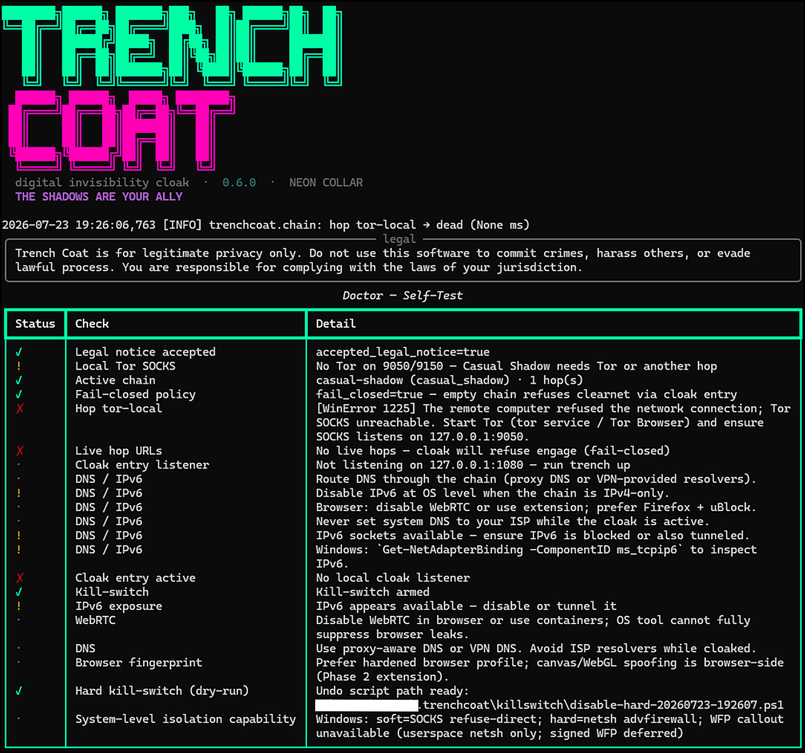
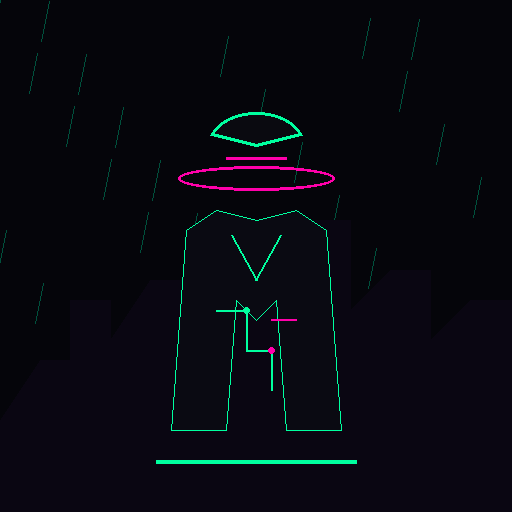
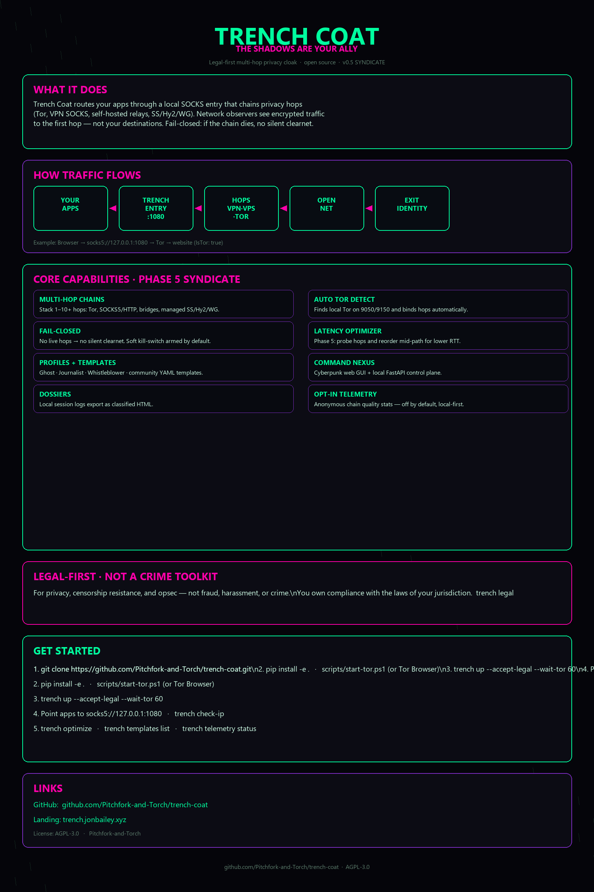

```
        .--.
       |o_o |      ::  T R E N C H   C O A T  ::
       |:_/ |
      //   \ \
     (|     | )     "In the neon rain, the only
    /'\_   _/`\      honest face is a missing one."
    \___)=(___/
```

# TRENCH COAT

### *The shadows are your ally.*

[](LICENSE)
[](https://python.org)
[](#development-roadmap)
[](#legal-notice)
[](https://trenchcoat.jonbailey.xyz/)

<p align="center">
  
</p>

<p align="center"><em>THE SHADOWS ARE YOUR ALLY</em></p>

**Trench Coat** is a desktop privacy system (CLI core + cyberpunk control nexus) that **chains network hops** - Tor, SOCKS5/HTTP proxies, commercial VPNs, self-hosted relays, and (by design) Shadowsocks, WireGuard, Hysteria2, I2P - to maximize anonymity and resist tracking **within the law**.

Think *digital invisibility cloak*: elegant, relentless, film-noir cool.

<p align="center">
  
  &nbsp;&nbsp;
  
</p>

<p align="center">
  
</p>

> **Not a crime toolkit.** No exploit packs. No "how to scam" modules. Serious privacy engineering for journalists, activists, researchers, and anyone who wants less of their life on a wiretap.

---

## Legal Notice

Trench Coat is for **legitimate privacy** only:

- Bypassing censorship and network discrimination  
- Reducing ISP / network observer tracking  
- Protecting people in high-surveillance environments  
- General operational security and personal privacy  

**Do not** use this software to commit crimes, harass people, facilitate fraud, or evade lawful process. You are solely responsible for complying with the laws that apply to you.

Run `trench legal` any time. First `trench up` requires `--accept-legal`.

---

## Features

| Capability | Status |
|------------|--------|
| Multi-hop chain builder + concurrent health probes | yes |
| Local SOCKS5 entry with nested proxy chaining | yes |
| Auto-detect Tor on **9050 / 9150**, bind hops | yes |
| Fail-closed + soft kill-switch | yes |
| Profiles: Ghost, Journalist, Whistleblower, Casual Shadow, Paranoid | yes |
| `trench check-ip` - IsTor + egress IP | yes |
| Session dossiers (JSON + classified HTML) | yes |
| Cyberpunk web Command Nexus + FastAPI control plane | yes |
| Ghost Continuum plane (`trench-cloak`) | yes |
| SEO/AEO landing + FAQ schema | yes |
| Split-tunnel + soft system route + DoH + IPv6 tools | yes (Phase 2) |
| Managed SS / Hy2 / WG + bridges + decoy + plugins | yes (Phase 3) |
| TTS, Tauri scaffold, map upgrade, browser companion | yes (Phase 4) |
| Latency optimizer + community templates + opt-in telemetry | yes (Phase 5) |
| Fail-closed refuse-direct + first-run + Nexus 2.0 | yes (v1.0 Neon Collar) |
| Full WFP signed callout / auto hard firewall | later |

---

## Quick Start

### Requirements

- Python **3.11+**
- Optional but recommended: [Tor](https://www.torproject.org/) or Tor Browser (`socks5://127.0.0.1:9050` or `:9150`)

### Install

```bash
git clone https://github.com/Pitchfork-and-Torch/trench-coat.git
cd trench-coat
python -m venv .venv

# Windows
.\.venv\Scripts\Activate.ps1

# Linux / macOS
source .venv/bin/activate

pip install -e .
# optional dev tools: pip install -e ".[dev]"
trench banner
trench first-run --accept-legal
```

### Engage with Tor

```bash
# Windows (Tor Browser installed)
.\scripts\start-tor.ps1

# Linux / macOS
./scripts/start-tor.sh   # or: sudo systemctl start tor

trench tor status
trench chain use casual-shadow
trench up --accept-legal --wait-tor 60
trench doctor
```

Point apps at:

```text
socks5://127.0.0.1:1080
```

Verify:

```bash
trench check-ip
# or
curl --socks5-hostname 127.0.0.1:1080 https://check.torproject.org/api/ip
```

Expected when healthy: `"IsTor": true` and an exit IP that is **not** your home address.

### Control Nexus (GUI)

```bash
trench gui
# Open http://127.0.0.1:8742 - Command Nexus 2.0 (status, hop map, profiles, dossiers)
```

---

## CLI

```text
trench legal | banner | status | doctor [--json]
trench first-run --accept-legal
trench tor status | newnym
trench check-ip | doh | split | ipv6
trench route soft | revert | scripts
trench chain list | show | new | use
trench up --accept-legal [--auto-tor] [--wait-tor 60]
trench optimize | templates list | templates import <id>
trench telemetry status | enable | disable
trench plugins list | speak | speedtest | gui
```

Config (override with `TRENCH_COAT_CONFIG`):

- Windows: `%APPDATA%\trenchcoat\trench-coat\config.yaml` (platformdirs)
- Linux: `~/.config/trench-coat/config.yaml`
- macOS: `~/Library/Application Support/trench-coat/config.yaml`

---

## Architecture

```text
Apps  ->  Trench Coat SOCKS entry (127.0.0.1:1080)
              -> hop-1 -> hop-2 -> ... -> hop-N (often Tor)
                    -> open net
```

- **Core**: Python package `trenchcoat` under `src/`  
- **Engine**: concurrent hop probes, rotator, DNS guard, kill-switch, nested proxy server  
- **Tor-aware**: auto-bind local Tor SOCKS; `check-ip` via check.torproject.org  
- **GUI**: static cyberpunk nexus + local FastAPI  
- Docs: [`docs/architecture/OVERVIEW.md`](docs/architecture/OVERVIEW.md) · [`docs/WHAT_THIS_DOES.md`](docs/WHAT_THIS_DOES.md)

---

## Profiles

| Profile | Posture |
|---------|---------|
| **Casual Shadow** | Tor-only - default, best first run |
| **Ghost** | VPN then Tor |
| **Journalist** | Self-hosted then VPN then Tor, decoy traffic |
| **Whistleblower** | 4+ hops, aggressive rotation |
| **Paranoid** | Full stack placeholders + Tor - expect latency |

---

## Security

- Fail-closed when no live hops (refuse clearnet via cloak entry)  
- Control API loopback by default  
- Soft kill-switch always; hard OS rules opt-in with undo-first (no accidental lockout)  
- See [`docs/security/HARDENING.md`](docs/security/HARDENING.md), [`docs/dossiers/THREAT_MODEL.md`](docs/dossiers/THREAT_MODEL.md), and [`docs/security/AUDIT_CHECKLIST.md`](docs/security/AUDIT_CHECKLIST.md)

Report vulnerabilities privately - [SECURITY.md](SECURITY.md).

---

## Development Roadmap

| Phase | Codename | Focus |
|-------|----------|--------|
| **0** | Neon Thread | MVP CLI + chain + GUI |
| **1** | Wet Pavement | Tor UX, identity, concurrent probes - done |
| **1.5** | Ghost Plane | Continuum plane, SEO/AEO - done |
| **2** | Circuit City | Split-tunnel, soft route, DoH, IPv6 - done |
| **3** | Obsidian Collar | Managed hops, bridges, decoy, plugins - done |
| **4** | Jazz for Ghosts | TTS, Tauri, map, companion extension - done |
| **5** | Syndicate | Optimizer, templates, telemetry, audit prep - done |
| **7** | Neon Collar | Fail-closed hardening, first-run, Nexus 2.0 - **v1.0.0** |

Full plan: [`docs/DEVELOPMENT_PLAN.md`](docs/DEVELOPMENT_PLAN.md) · residual: [`docs/ROADMAP_RESIDUAL.md`](docs/ROADMAP_RESIDUAL.md)

---

## Project Layout

```text
trench-coat/
  src/trenchcoat/     # CLI + engine + hops + API
  gui/web/            # Command Nexus
  landing/            # trenchcoat.jonbailey.xyz
  docs/               # Architecture, threat model, security
  assets/             # Logos, marketing, OG card
  configs/            # Example YAML + templates
  scripts/            # install, start-tor, deploy-landing
  tests/
```

---

## Related tools (Pitchfork-and-Torch)

Trench Coat is **egress privacy** (Tor / multi-hop). Pair with host network tuning and defense when you need the full stack:

| Project | Role |
|---------|------|
| [NetForge suite](https://github.com/Pitchfork-and-Torch/netforge-windows) ([linux](https://github.com/Pitchfork-and-Torch/netforge-linux) / [macos](https://github.com/Pitchfork-and-Torch/netforge-macos)) | Local DNS/TCP/metric hardening - not a proxy chain |
| [ghost-continuum](https://github.com/Pitchfork-and-Torch/ghost-continuum) | Defense / deception plane with optional Trench Coat integration |
| [Fl1pp3r69](https://github.com/Pitchfork-and-Torch/Fl1pp3r69) | Authorized RF/NFC field ops (separate domain) |

See also NetForge [SUITE.md](https://github.com/Pitchfork-and-Torch/netforge-windows/blob/main/SUITE.md).

---

## FAQ

### Is Trench Coat a VPN?

No. It's a **legal-first multi-hop privacy cloak** with a Tor-aware CLI and control nexus. Think chain composition and monitoring - not a commercial VPN client.

### Does it phone home?

No mandatory product telemetry (opt-in chain quality only). Control API defaults to loopback. See [SECURITY.md](SECURITY.md).

### Can I use it with NetForge?

Yes. NetForge hardens the **host** network stack; Trench Coat handles **egress** privacy. They're complementary - see the related tools table above.

### What license is this under?

**AGPL-3.0-or-later** - see [LICENSE](LICENSE).

---

## Contributing

See [CONTRIBUTING.md](CONTRIBUTING.md). Ground rules: legal-first, honest opsec, reliability over chrome.

## Support the work

Trench Coat is **free and open source**. Bug reports and feature requests are welcome via [GitHub Issues](https://github.com/Pitchfork-and-Torch/trench-coat/issues).

## License

**AGPL-3.0-or-later** - see [LICENSE](LICENSE).

---

<p align="center">
  
</p>

```
THE SHADOWS ARE YOUR ALLY
```
