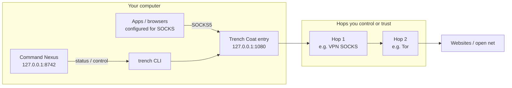
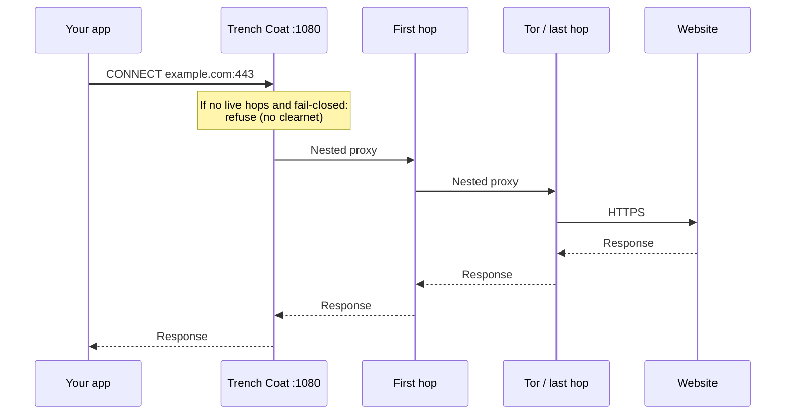
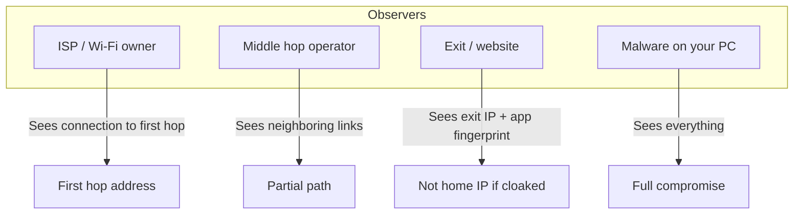

# How the cloak works

*A guided tour with diagrams. No jargon required for the main path.*

---

## 1. Intent

Trench Coat is a **legal-first multi-hop orchestrator**. You already run (or will run) privacy hops such as Tor. Trench Coat:

1. Offers one local address for apps: `socks5://127.0.0.1:1080`  
2. Chains those hops in order  
3. Watches health and **fails closed** if the chain dies  

It does **not** replace Tor Browser, Signal, or OS security updates.

---

## 2. Architecture diagram (components)



*(If Mermaid does not render in your viewer, use the ASCII versions below.)*

```text
  [ Apps ] --socks5--> [ Trench :1080 ] --> [ Hop1 ] --> [ Hop2 ] --> [ Internet ]
                              ^
                              |
                    [ CLI / Command Nexus ]
```

---

## 3. Packet path (one request)



ASCII:

```text
  App asks Trench: "Connect me to example.com"
       │
       ├─ Chain healthy? ──yes──► walk through hops ──► website
       │
       └─ Chain dead + fail-closed? ──► "No." (connection refused)
                                        Your home IP is NOT used
                                        *through this door*
```

---

## 4. Who sees what



| Observer | Typical view when cloak is healthy |
|----------|--------------------------------------|
| Coffee-shop Wi‑Fi / ISP | You talking to the **first hop**, not a full list of every site (if DNS is careful) |
| Middle hop | Traffic next to it — diversify operators |
| Website | **Exit** IP (e.g. Tor exit) + browser/app fingerprint |
| Malware on your PC | Everything — fix the computer first |

---

## 5. Fail-closed vs leak

```text
  HEALTHY
  App ──► Trench ──► hops ──► site

  HOPS DEAD (v0.6+)
  App ──► Trench ──X  refused
                      status: fail_closed_tripped

  APP NEVER USED SOCKS (soft mode)
  App ──────────────────────────► site as home IP
  (not protected — configure the app)
```

**Soft kill-switch** = the door locks when the coat tears.  
**Hard kill-switch** = also try to seal other exits (advanced, opt-in, undo-first).

---

## 6. Profiles (pick a coat weight)

```text
  Casual Shadow     Tor only — light, good first coat
  Ghost             VPN → Tor — heavier, better first-hop privacy
  Journalist        Multi-hop field posture
  Whistleblower /
  Paranoid          Longer chains, more latency, stricter policy
```

Start light. Add weight only when you understand the tradeoffs.

---

## 7. Verify you put the coat on

```text
  1. trench first-run --accept-legal
  2. Start Tor (9050 or 9150)
  3. trench doctor          ← fix red items
  4. trench up --accept-legal --wait-tor 60
  5. trench check-ip        ← want IsTor: true
  6. trench gui             ← live map + status
```

Command Nexus (GUI) shows **CLOAKED**, hop health, fail-closed **HOLD** if the chain dies, and session dossiers.

---

## 8. Common foot-guns (avoid these)

| Foot-gun | Safer habit |
|----------|-------------|
| Browser still on “no proxy” | Set SOCKS5 host 127.0.0.1 port 1080, or use a tool that forces proxy |
| DNS / WebRTC leak | Prefer remote DNS via SOCKS; disable WebRTC or use hardened browser |
| IPv6 still on while chain is IPv4 | Check `trench doctor` / IPv6 guidance |
| Only one untrusted commercial hop | Diversify; prefer Tor as last hop when appropriate |
| Hard kill-switch without testing undo | Always read the undo script first; dry-run |
| Assuming the GUI cloaks the whole OS | Soft mode is app-SOCKS; hard mode is separate and opt-in |

---

## 9. Legal-first reminder

Legitimate privacy only. Not for crime. You own compliance with local law.  
Details: `trench legal` · [WHAT_THIS_DOES.md](WHAT_THIS_DOES.md) · [THREAT_MODEL.md](dossiers/THREAT_MODEL.md)
