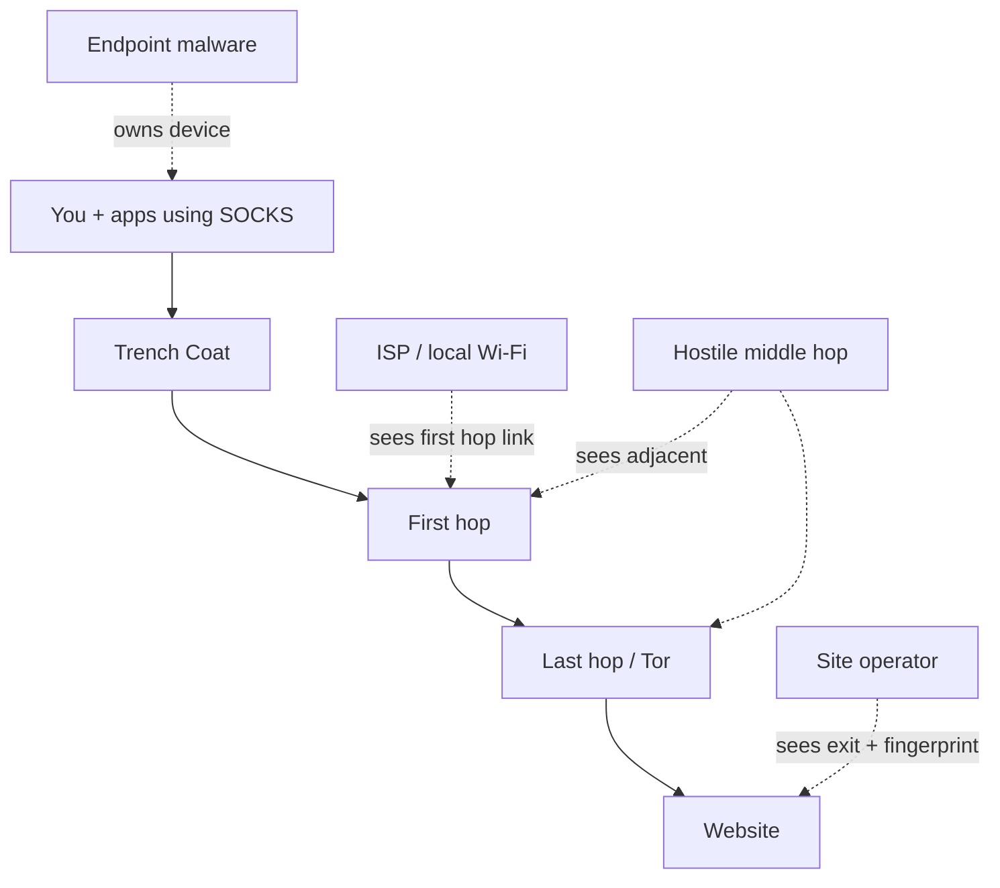

# Threat model — Trench Coat

**Public · legal-first · plain language + operator tables**  
**Version alignment:** 1.0+ Neon Collar (fail-closed refuse-direct)

This document answers: *Who might look at my traffic, what does the cloak change, and what still hurts me?*

For the shortest non-expert path, start with [WHAT_THIS_DOES.md](../WHAT_THIS_DOES.md) and [HOW_THE_CLOAK_WORKS.md](../HOW_THE_CLOAK_WORKS.md).

---

## 1. Product in one paragraph

Trench Coat is a **local multi-hop privacy orchestrator**. It exposes a loopback SOCKS5 entry and chains hops you already run (Tor, SOCKS5/HTTP proxies, self-hosted relays, managed drivers). Defaults are **fail-closed** at that entry: when no hops are live, CONNECT is refused rather than dialing clearnet. It is **not** a crime toolkit and **not** a full anonymity guarantee.

---

## 2. Assets (what we try to protect)

| Asset | Everyday meaning | How the cloak helps |
|-------|------------------|---------------------|
| Home / device IP | “Where I am on the network” | Destinations see exit hop IP if apps use the cloak and hops are healthy |
| Destination list | “Which sites I visit” | ISP often sees first hop only (DNS still needs care) |
| DNS queries | “Name lookups” | Better if apps use remote SOCKS DNS; system DNS can still leak |
| Session timing | “When I was active” | Multi-hop can blur a little; does **not** erase timing analysis |
| Local config & dossiers | Hop lists, session notes | Stay on disk unless you export; treat as sensitive |

---

## 3. Trust boundary diagram

```text
                    UNTRUSTED NETWORK
                           │
              ┌────────────┴────────────┐
              │   hops (Tor, proxies…)  │
              └────────────┬────────────┘
                           │
              ┌────────────┴────────────┐
              │   Trench Coat process   │  ← fail-closed policy
              │   local SOCKS :1080     │
              └────────────┬────────────┘
                           │ loopback only (default)
              ┌────────────┴────────────┐
              │  Apps you configure     │
              │  + GUI/API on localhost │
              └─────────────────────────┘
```

**Rule of thumb:** Anything that does not use `:1080` is **outside** the soft cloak.

---

## 4. Adversaries



| Adversary | What they can do | Cloak helps? | Residual risk |
|-----------|------------------|--------------|---------------|
| Local network / ISP | Watch metadata to first hop | Yes — first hop becomes the visible peer | They see *that* you use Tor/VPN |
| Website / service | Sees IP + app fingerprint | Yes for IP (exit); **no** for fingerprint alone | Logins, cookies, canvas |
| Compromised hop | Watches neighbors | Multi-hop reduces single-hop trust | Colluding hops |
| Exit operator | Sees exit→site for clear HTTP | Prefer HTTPS + Tor for browsing isolation | HTTPS SNI / destination still nuanced |
| Endpoint malware | Full control of PC | **No** | Total compromise |
| Global passive adversary | Correlate many links | Weak reduction only | Research-class threat remains |
| Legal compulsion | Demand devices/logs | Operational hygiene only | Not a software bug |

---

## 5. Security properties we claim (and don’t)

### We claim (when configured correctly)

- Loopback SOCKS entry does **not** silently clearnet when `fail_closed` is on and hop list is empty (v0.6+).  
- Multi-hop failure does **not** silently degrade to first-hop-only unless `allow_partial_chain` is enabled.  
- Soft isolation is honest: **only SOCKS-using apps** are covered unless hard kill-switch is applied.  
- Control API is intended for **localhost**; do not expose it to the internet without auth (not shipped).  
- Telemetry is **off** unless the user opts in.

### We do **not** claim

- Whole-OS coverage in soft mode  
- Browser anti-fingerprinting  
- Malware resistance  
- Perfect anonymity or GPA resistance  
- Signed Windows WFP kernel isolation (not shipped)  
- Safety for criminal use (product forbids this purpose)

---

## 6. Soft vs hard isolation

| Mode | Mechanism | Failure mode you must understand |
|------|-----------|----------------------------------|
| Soft (default path) | `refuse_direct` at SOCKS; apps must use `:1080` | Non-proxied apps still leak real path |
| Hard (opt-in) | OS firewall scripts; undo written **before** apply | Misconfiguration can cut all network until undo |
| Future WFP | Signed callout / divert | **Not available** — do not assume |

Hard mode is **never** auto-applied on hop death (lockout risk). Documented in HARDENING and kill-switch CLI.

---

## 7. Profiles as threat postures

| Profile | Typical intent | Latency | Notes |
|---------|----------------|---------|-------|
| Casual Shadow | Everyday Tor-only | Lower | Best first profile |
| Ghost | VPN then Tor | Medium | Better first-hop privacy |
| Journalist | Field multi-hop | Higher | Templates + decoy options |
| Whistleblower / Paranoid | Max separation | Highest | Strict policy; verify carefully |

---

## 8. Operator verification (confidence ritual)

```text
trench first-run --accept-legal
trench doctor                 # exit 0/1/2
trench up --accept-legal --wait-tor 60
trench check-ip               # IsTor true when Tor is egress
# Optional: kill Tor mid-session → CONNECT via :1080 should fail, not home IP
```

Status fields: `fail_closed_tripped`, `refuse_direct`, `refused_connects`, hop health on Command Nexus.

---

## 9. Non-goals (product)

- Making illegal activity “safe”  
- Silent cloud surveillance of users  
- Exploit packs / “evade law enforcement” features  
- Marketing perfect anonymity  

---

## 10. Related materials

| Doc | Role |
|-----|------|
| [WHAT_THIS_DOES.md](../WHAT_THIS_DOES.md) | Non-expert does / doesn’t |
| [HOW_THE_CLOAK_WORKS.md](../HOW_THE_CLOAK_WORKS.md) | Diagrams & walkthrough |
| [HARDENING.md](../security/HARDENING.md) | Operator checklist |
| [THIRD_PARTY_AUDIT.md](../security/THIRD_PARTY_AUDIT.md) | Auditor onboarding |
| [AUDIT_CHECKLIST.md](../security/AUDIT_CHECKLIST.md) | Release gate |
| `SECURITY.md` | Vulnerability disclosure |
